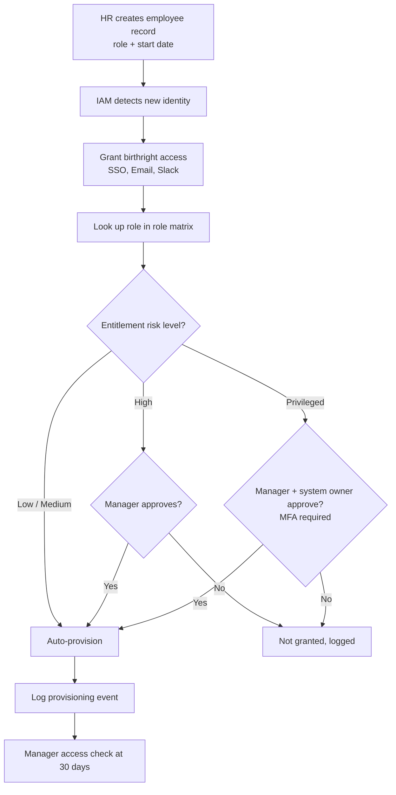
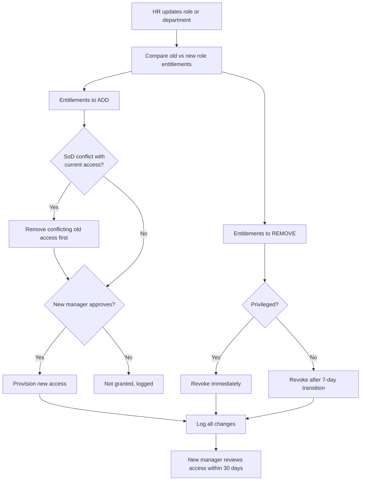
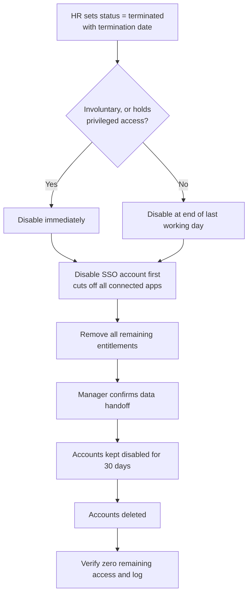

# Identity Lifecycle — Nittany Analytics (fictional)

This document defines how access is **requested, approved, provisioned, reviewed, and revoked** across the three identity lifecycle events: **Joiner, Mover, and Leaver (JML)**. It builds on the roles, entitlements, and SoD rules in [`org-model.md`](org-model.md).

## 1. Principles

- **HR is the source of truth.** Every lifecycle event starts with a change in the HR system (`data/employees.csv`), never with an ad-hoc request to IT.
- **Access follows the role.** Role-based access is granted from the role matrix (`data/role_matrix.csv`); anything else is a time-bound exception.
- **Least privilege by default.** When in doubt, access is not granted until approved.
- **Separation of duties is checked before access is granted**, not only during reviews.
- **Every change is logged:** who, what, when, and who approved it.

## 2. Actors

| Actor | Responsibility |
|---|---|
| HR | Creates, updates, and terminates employee records |
| Manager | Approves access for their direct reports; certifies it during reviews |
| System owner | Approves high-risk and privileged access to their system |
| IAM / IT team | Runs provisioning and deprovisioning; maintains the role matrix |
| Employee | Requests exception access when needed |

## 3. Lifecycle Summary

| Event | Trigger | Request | Approval | Provision | Review | Revoke |
|---|---|---|---|---|---|---|
| **Joiner** | HR creates record with role and start date | Automatic, from role matrix | Low/Medium: none. High: manager. Privileged: manager + system owner | Birthright on day 1, role access by start date | Manager checks access at 30 days | — |
| **Mover** | HR changes role or department | Automatic for new role; extras via request | New manager; system owner for privileged | Add new-role access after SoD check | New manager reviews within 30 days | Old-role access removed (privileged immediately, others within 7 days) |
| **Leaver** | HR sets status to terminated | Automatic | None needed | — | Verify zero remaining access | All access disabled on last day (immediately if involuntary or privileged) |

## 4. Joiner

**Example:** Priya is hired as an **AP Clerk**.

1. HR creates her record with role `AP Clerk` and a start date.
2. IAM detects the new identity and grants **birthright access** (`SSO:Login`, `Email:Mailbox`, `Slack:Member`).
3. IAM looks up `AP Clerk` in the role matrix: `ERP:ViewReports`, `ERP:CreateVendor`, `ERP:EnterInvoice`.
4. `ERP:ViewReports` (Medium) is auto-provisioned. `ERP:CreateVendor` and `ERP:EnterInvoice` (High) require manager approval.
5. Every grant is logged with the approver.
6. At 30 days, her manager confirms the access is correct.

## 5. Mover

**Example:** Priya is promoted from **AP Clerk** to **Finance Manager**.

This is the riskiest event, because people tend to *keep* old access while gaining new access ("privilege creep"). The Finance Manager role includes `ERP:ApprovePayment`. If Priya kept her AP Clerk access, she would hold:
- `ERP:CreateVendor` + `ERP:ApprovePayment` → violates **SOD-01**
- `ERP:EnterInvoice` + `ERP:ApprovePayment` → violates **SOD-02**

So the old conflicting access must be removed **before** the new access is granted.

1. HR updates her role to `Finance Manager`.
2. IAM compares old and new role entitlements:
   - **Add:** `ERP:ApprovePayment`, `Payroll:Read`, `Payroll:Approve`
   - **Remove:** `ERP:CreateVendor`, `ERP:EnterInvoice`
   - **Keep:** `ERP:ViewReports` (in both roles), birthright
3. SoD check finds conflicts, so `ERP:CreateVendor` and `ERP:EnterInvoice` are removed first.
4. Her new manager approves the additions; `Payroll:Approve` (Privileged) also needs the system owner.
5. Remaining old-role access is removed (privileged immediately, others after a 7-day transition window).
6. Her new manager reviews her full access within 30 days.

## 6. Leaver

**Example:** an IT Administrator resigns.

1. HR sets status to `terminated` with a termination date.
2. Because this person holds **privileged** access (`Directory:ManageUsers`, `AWS:Admin`), all access is disabled immediately at termination. For non-privileged voluntary leavers, access is disabled at the end of their last working day.
3. The **SSO account is disabled first**, which cuts off every connected application at once.
4. All remaining entitlements are removed.
5. The manager confirms handoff of files and data.
6. Accounts stay disabled (not deleted) for 30 days for records, then are deleted.
7. IAM verifies that **zero access remains** and logs the result.

## 7. Exception Access Requests

Access outside a person's role (e.g., an engineer needing temporary `ERP:ViewReports` for a project):

1. Employee submits a request with a business reason.
2. Automatic SoD check against their current access; conflicts are rejected.
3. Manager approves; system owner also approves if High or Privileged.
4. Access is granted with an **expiration date (max 90 days)**.
5. Expired exceptions are removed automatically.

## 8. Access Reviews (Certifications)

| Access type | Frequency | Reviewer |
|---|---|---|
| Privileged | Quarterly | Manager + system owner |
| All other access | Semi-annually | Manager |
| After a mover event | Within 30 days | New manager |

- Reviewers **certify** (keep) or **revoke** each entitlement.
- Revocations are completed within **5 business days**.
- Reviews not completed within 14 days are escalated to the reviewer's manager.

## 9. Service Levels

| Action | Target |
|---|---|
| Birthright access for joiners | Day 1 |
| Role access for joiners | By start date |
| Leaver, privileged or involuntary | Immediately |
| Leaver, standard | End of last working day |
| Mover, privileged old access | Immediately |
| Mover, other old access | Within 7 days |
| Review revocations | Within 5 business days |

## 10. How the Access Review Script Enforces This

The Python script in `src/` checks real access data against this design:

| Lifecycle rule | Script check |
|---|---|
| Leavers have zero access | Flags terminated employees with any access |
| Movers lose old-role access | Flags access not in the current role's matrix |
| SoD checked before granting | Flags anyone holding a conflicting pair |
| Access is reviewed and used | Flags access unused for 90+ days |
